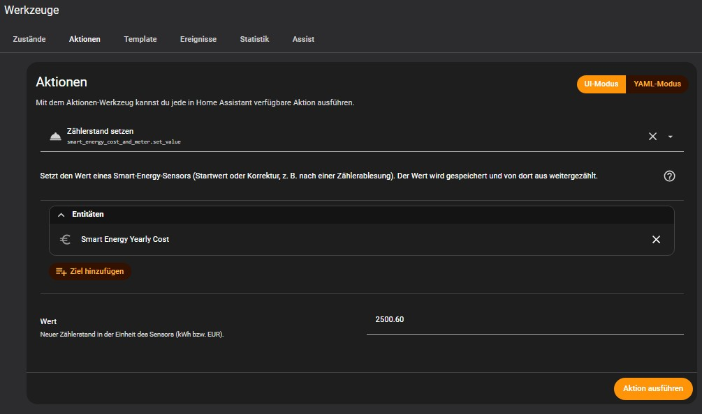

# ⚡ Smart Energy Cost & Meter für Home Assistant

[](https://www.home-assistant.io/)
[](https://hacs.xyz/)
[](https://opensource.org/licenses/MIT)

🇬🇧 [English](https://github.com/LotharWoman/Smart-Energy-Cost-and-Meter/blob/main/README.md) | 🇩🇪 Deutsch

**Smart Energy Cost & Meter** macht aus **einem** Energiesensor bis zu 16 Verbrauchs- und Kostenzähler für das Energie-Dashboard. Es rechnet nicht nur `kWh × Preis`, sondern schlägt auch die anteilige **Grundgebühr** deines Vertrags auf. So zeigen die Kostensensoren, was du tatsächlich bezahlen musst.

## 🚀 Funktionen

### 💰 Realistische Kostenerfassung
- **Fester oder dynamischer Preis:** Du nutzt einen festen Preis pro kWh oder wählst einen Preis-Sensor in €/kWh (z. B. Tibber, auch mit viertelstündlichen Preisen). Jeder Verbrauchsschritt wird mit dem in diesem Moment gültigen Preis bewertet.
- **Automatischer Rückfall:** Ist der Preis-Sensor nicht verfügbar oder liefert keine Zahl, gilt der Festpreis.
- **Anteilige Grundgebühr:** Der Tagesanteil (Monatsgebühr ÷ Tage des jeweiligen Monats) wird einmal täglich zu einer frei wählbaren Abrechnungszeit gebucht.

### ⏱ Flexible Zeiträume
Für Energie (kWh) und Kosten (EUR) kannst du jeden dieser 8 Zeiträume aktivieren:
**Gesamt · Jahr · Quartal · Monat · Woche · Tag · Stunde · Viertelstunde**

Die Zeitraum-Sensoren beginnen an der Kalendergrenze wieder bei 0 (die Woche beginnt am Montag). Die Kostensensoren melden `last_reset`, damit die Home-Assistant-Statistik den Rücksprung richtig als Reset behandelt und nie als negativen Verbrauch.

### 🛡 Robustes Zählen
In allen alltäglichen Situationen zählen die Sensoren vom letzten bekannten Wert weiter:
- **Zähler getauscht** oder neu gestartet (neuer Zähler beginnt bei 0 oder bei einem stark abweichenden Wert): Die Sensoren zählen dort weiter, wo sie standen. Es geht nichts verloren und nichts wird doppelt gezählt.
- **Eingangssensor kurz nicht verfügbar:** Der Verbrauch während des Ausfalls wird nachgeholt, sobald der Sensor wieder da ist.
- **Neustart von Home Assistant:** Die Werte werden wiederhergestellt, der Verbrauch der Ausfallzeit wird nachgeholt, und eine verpasste Grundgebühr wird anschließend gebucht.
- **Integration entfernt und neu installiert:** Die Werte liegen im eigenen Speicher der Integration (`.storage/smart_energy_cost_and_meter.sensor_values`), unabhängig von der Entity-Registry.
- **Wechsel des Eingangssensors** in den Optionen (z. B. neuer Zähler mit neuer Entität): Alle Werte bleiben erhalten, es beginnt nur eine neue Basis.

### 🎯 Startwerte und Korrekturen setzen
Werte in *Entwicklerwerkzeuge → Zustände* zu setzen funktioniert nicht, sie werden sofort überschrieben. Nutze stattdessen die Aktion `smart_energy_cost_and_meter.set_value` für jeden Sensor der Integration, jederzeit (z. B. nach dem Ablesen deines echten Zählers).

### 🛠 Einfache Konfiguration
Alles läuft über die Home-Assistant-Oberfläche, YAML ist nicht nötig:
- Energiesensor (kWh, ansteigend)
- Fester Preis pro kWh
- Preis-Sensor (optional, €/kWh)
- Monatliche Grundgebühr
- Uhrzeit, zu der die tägliche Grundgebühr gebucht wird
- Welche der 16 Sensoren angelegt werden

## 📉 So funktioniert die Grundgebühr

```
Tagesanteil = Monatsgebühr / Tage des jeweiligen Monats
```

Einmal täglich, zur eingestellten Abrechnungszeit, wird dieser Betrag auf die Kostensensoren **Gesamt, Jahr, Quartal, Monat, Woche und Tag** aufgeschlagen. Die Kostensensoren für Stunde und Viertelstunde enthalten nur die Energiekosten.

$$\text{Kosten}_{Zeitraum} = \sum (\text{kWh} \times \text{Preis}) + \sum_{Tage} \frac{\text{Monatsgebühr}}{\text{Tage im Monat}}$$

Dein **Tageskosten**-Sensor zeigt damit nicht nur den heute verbrauchten Strom, sondern auch den Vertragsanteil dieses Tages.

## 📸 Galerie
- **Integrationsmenü:** 
- **Werkzeug->Aktionen:** 
- **Konfigurationsdialog:** 
- **Entitätenliste:** 

## 🛠 Installation

### Über HACS (empfohlen)
1. Öffne **HACS** → **Integrationen**.
2. Klicke oben rechts auf die drei Punkte → **Benutzerdefinierte Repositories**.
3. Füge `https://github.com/LotharWoman/Smart-Energy-Cost-and-Meter` ein.
4. Wähle als Kategorie **Integration** → **Hinzufügen**.
5. Herunterladen und **Home Assistant neu starten**.

### Manuelle Installation
1. Kopiere den Ordner `custom_components/smart_energy_cost_and_meter/` nach `/config/custom_components/`.
2. Starte Home Assistant neu.

Benötigt Home Assistant 2026.1.0 oder neuer.

## ⚙️ Einrichtung
1. Gehe zu **Einstellungen** → **Geräte & Dienste** → **Integration hinzufügen**.
2. Suche nach **Smart Energy Cost & Meter**.
3. Konfiguriere:
   - **Energiesensor:** dein Hauptzähler (muss kWh liefern)
   - **Fester Preis:** dein Standardpreis pro kWh
   - **Preis-Sensor:** (optional) ein Sensor mit dem aktuellen Preis in €/kWh
   - **Monatliche Grundgebühr:** der monatliche Grundpreis deines Vertrags
   - **Abrechnungszeit:** Uhrzeit, zu der die tägliche Grundgebühr gebucht wird (z. B. `00:30:00`)
4. Wähle die Sensoren (Tag, Monat, …), die angelegt werden sollen.

Die Sensoren heißen zum Beispiel `sensor.smart_energy_total_energy` und `sensor.smart_energy_daily_cost`.

## 🎚 Startwert setzen

Öffne **Entwicklerwerkzeuge → Aktionen**, wähle **Zählerstand setzen** (`smart_energy_cost_and_meter.set_value`) und wähle den Sensor:

```yaml
action: smart_energy_cost_and_meter.set_value
target:
  entity_id: sensor.smart_energy_total_energy
data:
  value: 12345.6
```

Der Wert gilt in kWh bei Energiesensoren und in EUR bei Kostensensoren. Er wird sofort gespeichert, übersteht Neustarts, und das Zählen läuft von ihm aus weiter.

> **Tipp:** Setze Startwerte, *bevor* du die Sensoren ins Energie-Dashboard aufnimmst. Ein Sprung von 0 auf 12345 kWh würde dort sonst als Verbrauch dieser Stunde erscheinen. Ist das schon passiert, korrigierst du den Ausreißer unter *Entwicklerwerkzeuge → Statistiken*.

## ℹ️ Gut zu wissen
- Es wird nur **eine Instanz** der Integration unterstützt.
- Der Eingangssensor muss **kWh** liefern.
- **Zählerwechsel:** Fällt der Eingangswert unter 90 % des letzten Werts, gilt das als Zählerreset, und der neue Wert zählt als Verbrauch seit dem Reset. Ein Anstieg um mehr als 50 kWh zwischen zwei Messwerten zählt nicht als Verbrauch (der neue Wert wird nur die neue Basis) und wird als Warnung ins Log geschrieben.
- **Sauberer Neustart:** Willst du nach dem Entfernen der Integration bei 0 beginnen, setze die Werte mit `set_value` auf 0 oder lösche `.storage/smart_energy_cost_and_meter.sensor_values`.

## 📜 Lizenz

Verbreitet unter der MIT-Lizenz. Siehe [LICENSE](LICENSE) für weitere Informationen.
