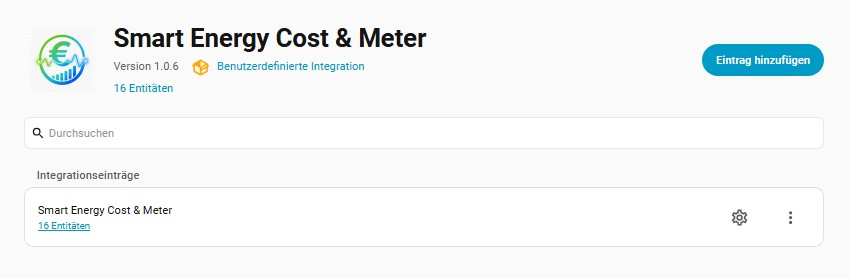
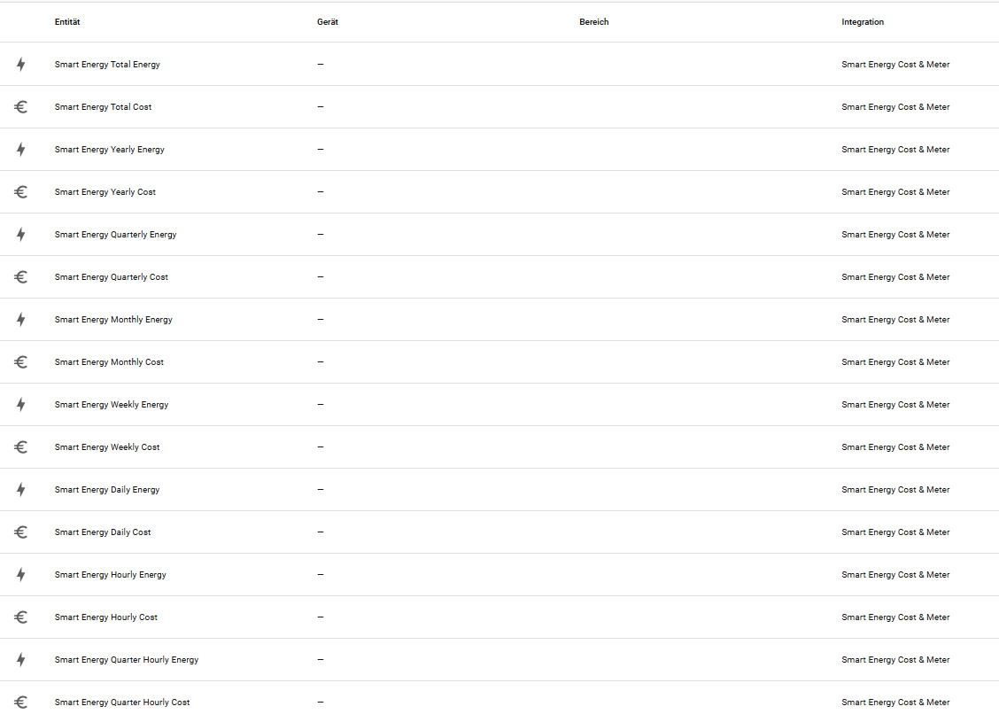
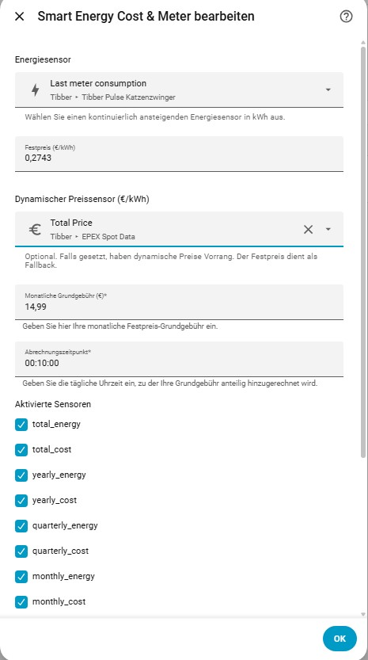

***

# ⚡ Smart Energy Cost & Meter for Home Assistant

**Smart Energy Cost & Meter** is a powerful Home Assistant integration designed to provide a realistic overview of your energy expenses. Unlike simple calculators, it doesn't just track consumption costs—it calculates the **actual total payable amount** by integrating both energy prices and pro-rated base fees across multiple time intervals.

## 🚀 Key Features

### 💰 Advanced Cost Tracking
- **Hybrid Pricing Logic:** Supports both **fixed prices** and **dynamic pricing** (e.g., Tibber, EPEX Spot).
- **Smart Fallback:** If a dynamic price sensor is configured, it takes priority. If the dynamic sensor is unavailable, the integration automatically falls back to your defined fixed price.
- **The "Total Cost" Approach:** It doesn't just calculate `kWh * Price`. It adds the proportional share of your **monthly base fee** (*Grundgebühr*) to the cost of the selected period.

### ⏱ Flexible Time Intervals
The integration automatically generates a comprehensive set of sensors for different timeframes, allowing you to see exactly how much you are spending:
- **Total** (Lifetime)
- **Yearly**
- **Quarterly**
- **Monthly**
- **Weekly**
- **Daily**
- **Hourly**

### 🛠 User-Friendly Configuration
Everything is handled via the Home Assistant UI. No YAML hacking is required. You can define:
- The energy sensor to track (increasing kWh).
- Your fixed price per kWh.
- Your dynamic price sensor.
- Your monthly base fee.
- The specific daily billing time (*Abrechnungszeitpunkt*) to ensure the pro-rated base fee is calculated accurately.

## 📉 How the Base Fee Calculation Works
This is what makes **Smart Energy Cost & Meter** unique. Instead of ignoring the base fee or only adding it once a month, the integration calculates it proportionally:

$$\text{Total Cost} = (\text{Energy Consumption} \times \text{Price}) + \left( \frac{\text{Monthly Base Fee}}{\text{Days in Month}} \times \text{Days in Interval} \right)$$

This means your **Daily Cost** sensor reflects not only the electricity you used today but also the "cost of having the contract" for that specific day.

## 📸 Gallery
- **Integration Menu:** 
- **Entity List:** 
- **Config Dialog:** 

## 🛠 Installation

### Via HACS (Recommended)
1. Open **HACS** $\rightarrow$ **Integrations**.
2. Click the three dots (top right) $\rightarrow$ **Custom repositories**.
3. Paste: `https://github.com/LotharWoman/Smart-Energy-Cost`
4. Select **Integration** as category $\rightarrow$ **Add**.
5. Download and **restart Home Assistant**.

### Manual Installation
1. Clone this repository into `/config/custom_components/smart_energy_cost/`.
2. Restart Home Assistant.

## ⚙️ Setup Guide
1. Go to **Settings** $\rightarrow$ **Devices & Services** $\rightarrow$ **Add Integration**.
2. Search for **Smart Energy Cost & Meter**.
3. **Configure your sensors:**
   - **Energy Sensor:** Select your main kWh meter.
   - **Fixed Price:** Your standard price per kWh.
   - **Dynamic Price Sensor:** (Optional) Select your spot-price sensor.
   - **Monthly Base Fee:** Enter your contract's monthly base charge.
   - **Billing Time:** Set the time (e.g., `00:10:00`) when the daily cycle resets.
4. Select which sensors (Daily, Monthly, etc.) you want to activate.

📜 License

Distributed under the MIT License. See LICENSE for more information.
